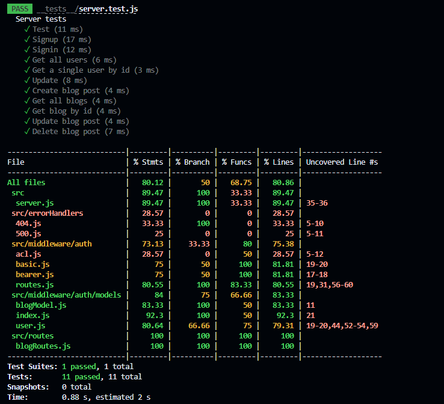

# blog-lab-09

## Process

- Plan out project
- create repo
- create UML
- add configs
- npm i express cors postgres sequelize eslint
- npm run init:config
- npm run db:create
- troubleshoot (only a part of the process if things are not working as they should)

## Collaboration

- Joshua Coffey
- Justin Mathieu

## UML

- Diagram.io

## tests

- Ran multiple console logs
- Chat GPT help
- Ran test suites multiple time to test for expected vs recieved

## Features

- Signup for the blog
- Users can post blog
- Users can view all other users blog posts
- Admins can delete posts and update posts depending if users post things that they are not supposed to.
