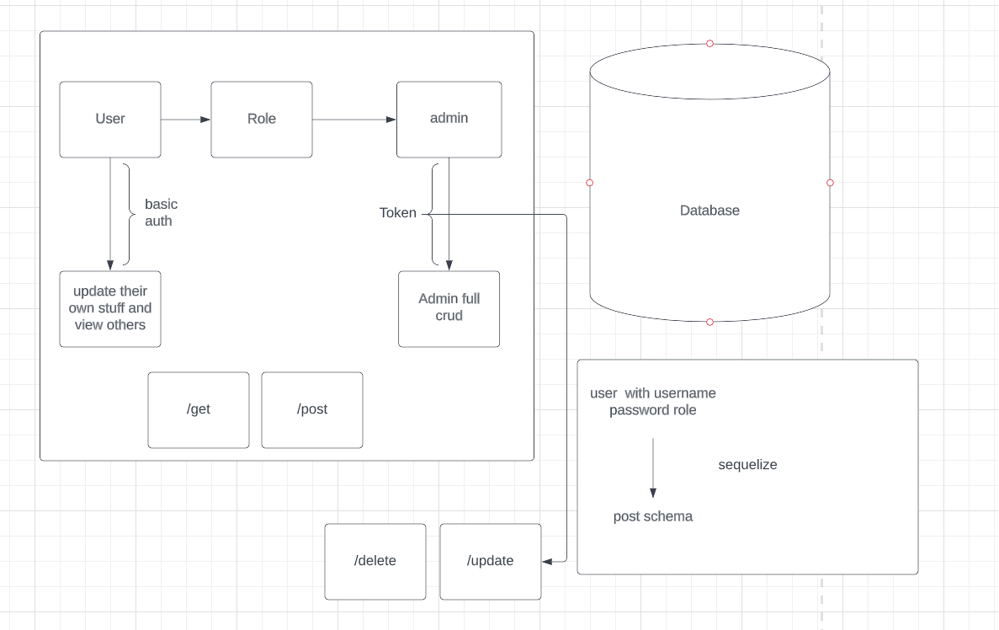
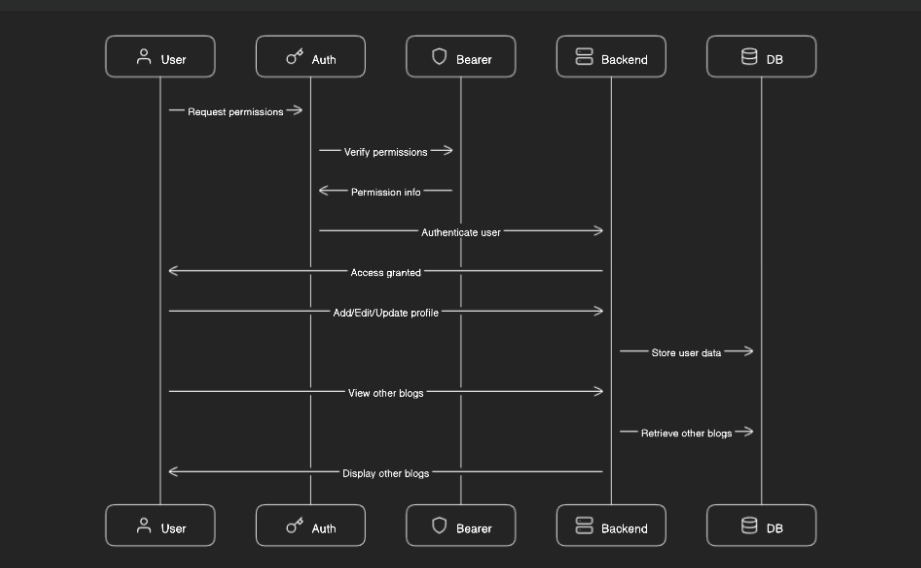

# blog-lab-09

## Process

- Plan out project
- create repo
- create UML
- add configs
- npm i express cors postgres sequelize eslint
- npm run init:config
- npm run db:create

## Collaboration

- Joshua Coffey
- Justin Mathieu

## UML

- Diagram.io

## tests
